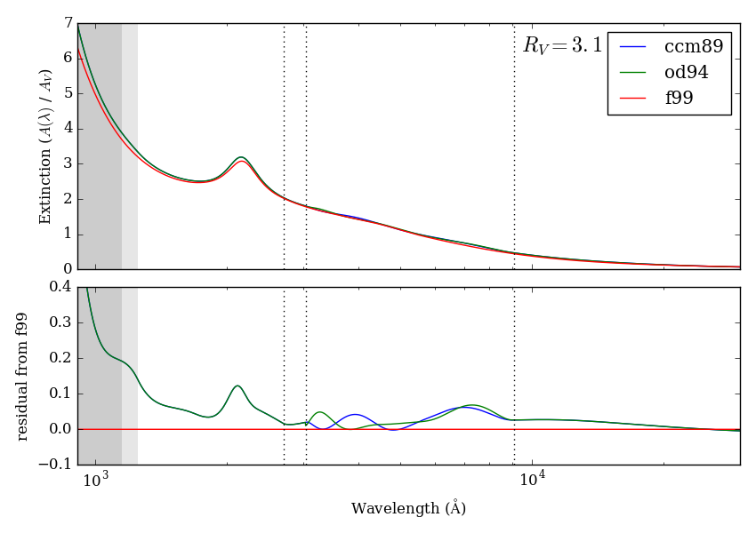

extinction
==========

*Fast interstellar dust extinction laws in Python*

[](https://travis-ci.org/kbarbary/extinction)

## API

```python
import numpy as np
import extinction

wave = np.array([2000., 3000., 4000.])
a_v = 1.0
r_v = 3.1

# Cardelli, Clayton & Mathis (1989)
extinction.ccm89(wave, a_v, r_v)

# O'Donnell (1994)
extinction.od94(wave, a_v, r_v)

# Fitzpatrick (1999)
extinction.f99(wave, a_v, r_v)


# Fitzpatrick (1999) is based on splines, which have to be
# constructed for a given R_V. If you are calling `f99` multiple
# times, with the same R_V, you can avoid constructing the spline
# multiple times as so:

f = extinction.F99Extinction(r_v)  # construct once
f(wave, a_v)  # call multiple times

```

## Comparison of functions


