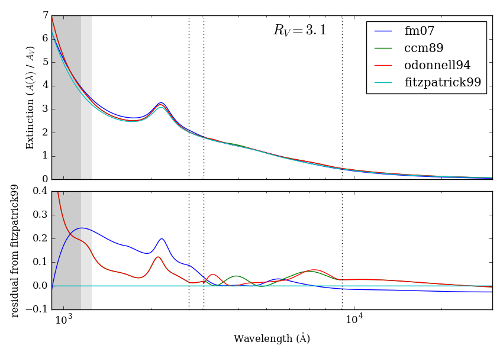

extinction
==========

*Fast interstellar dust extinction laws in Python*

Cython-optimized implementations of empirical dust exitinction laws
found in the literature.

Installation
------------

Extinction depends on numpy and scipy. Install these dependencies and then::

    pip install --no-deps extinction

**Development version / source code:** http://github.com/kbarbary/extinction

Usage
-----

**Functions:**

.. autosummary::
   :toctree: api

   extinction.ccm89
   extinction.odonnell94
   extinction.calzetti00
   extinction.fitzpatrick99
   extinction.fm07
   extinction.apply

**Classes:**

.. autosummary::
   :toctree: api

   extinction.Fitzpatrick99

**Examples:**

Get extinction in magnitudes at a set of wavelengths for various dust laws::

  >>> import numpy as np
  >>> import extinction

  >>> wave = np.array([2000., 4000., 8000.])  # wavelength in Angstroms

  # Cardelli, Clayton & Mathis (1989) with A_V = 1 and R_V = 3.1
  >>> extinction.ccm89(wave, 1.0, 3.1)
  array([ 2.84252644,  1.4645557 ,  0.59748901])  # extinction in magnitudes
   
  # O'Donnell (1994)
  >>> extinction.odonnell94(wave, 1.0, 3.1)
  array([ 2.84252644,  1.42617802,  0.60793495])

The Fitzpatrick (1999) and Fitzpatrick & Massa (2007) functions have fixed
:math:`R_V` of 3.1::
        
   # Fitzpatrick (1999) for fixed R_V = 3.1
   >>> extinction.fitzpatrick99(wave, 1.0)
   array([ 2.76225609,  1.42338583,  0.55346406])

   >>> extinction.fm07(wave, 1.0)
   array([ 2.90478329,  1.42645161,  0.54703201])
   
   # Fitzpatrick (1999) can also be used with other R_V values.
   # First, construct a function for a given R_V value (note capital "F"):
   >>> f = extinction.Fitzpatrick99(2.1)

   # Then, call the function:
   >>> f(wave, 1.0)
   array([ 4.28908428,  1.6266948 ,  0.47992809])

All extinction laws accept a ``unit`` keyword to change the interpretation of
the wavelength array from Angstroms to inverse microns::

  >>> wave = np.array([5., 2.5, 1.25])  # wavelength in inverse microns

  >>> extinction.ccm89(wave, 1.0, 3.1, unit='invum')
  array([ 2.84252644,  1.4645557 ,  0.59748901])  # extinction in magnitudes
   
To "redden" or "deredden" flux values by some amount, use the
``apply`` convenience function::

  >>> from extinction import ccm89, apply

  >>> flux = np.ones(3)

  # "redden" flux by A_V = 1.0
  >>> apply(ccm89(wave, 1.0, 3.1), flux)
  array([ 0.07294397,  0.25952412,  0.5767723 ])

  # "deredden" flux by A_V = 1.0
  >>> apply(ccm89(wave, -1.0, 3.1), flux)
  array([ 13.70915145,   3.85320647,   1.73378645])

**Comparison of functions**

   
**Parameterization**

The shape of most of the extinction laws here are parameterized by an
:math:`R_V` parameter, which is defined by :math:`A_V = R_V E(B-V)`,
where :math:`A_V` is the extinction in the *V* band, and
:math:`E(B-V)` is the difference in extinction between the *B* and *V*
bands.

License and Credits
-------------------

Part of this code originated in the specutils package.

The license is MIT.
